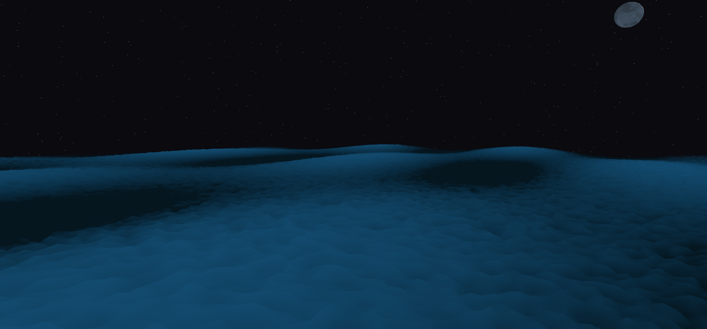

# 🌊 Ocean Shader



A WebGL project using **Three.js** and **React Three Fiber** to simulate realistic ocean waves with custom GLSL shaders. Features dynamic transitions between calm sea and storm conditions, with animated vertex displacement and color blending based on elevation and alpha maps.

## 🚀 Technologies

- [Next.js 15](https://nextjs.org/)
- [Three.js](https://threejs.org/)
- [@react-three/fiber](https://docs.pmnd.rs/react-three-fiber/)
- [@react-three/drei](https://github.com/pmndrs/drei)
- GLSL (Vertex + Fragment Shaders)
- `pnpm` as package manager

## 📦 Installation

```bash
pnpm install
pnpm dev
```

> Requires **Node.js >= 20** and **pnpm >= 8.14.0**
